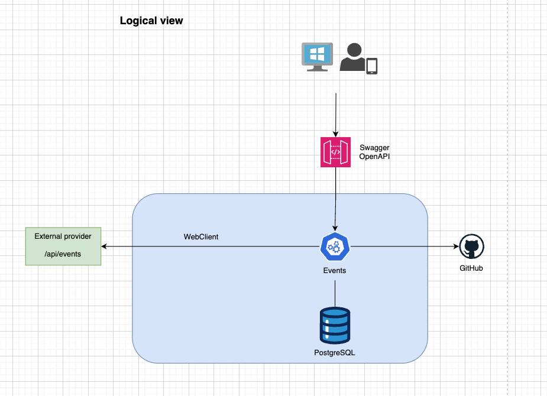
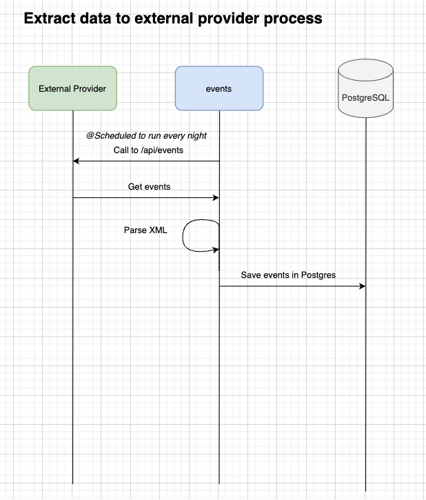
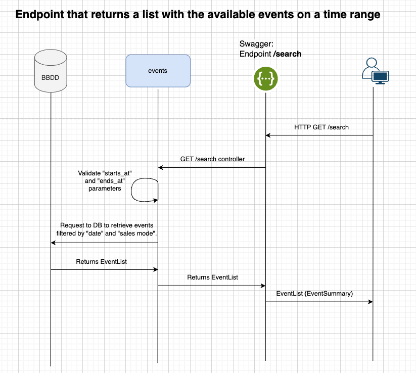
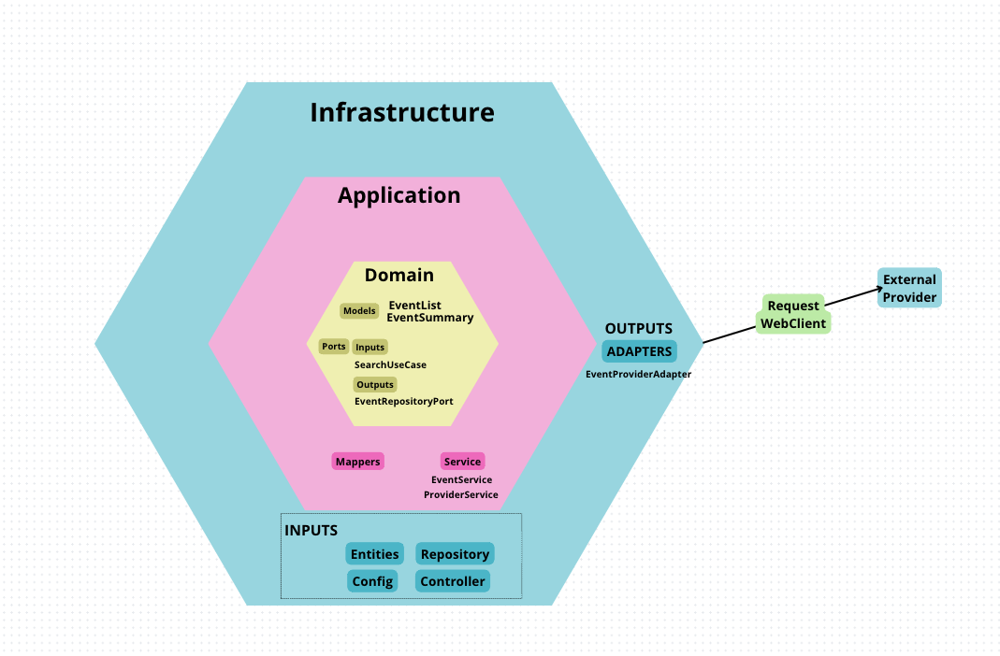
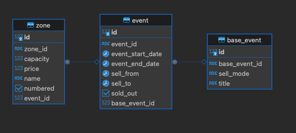
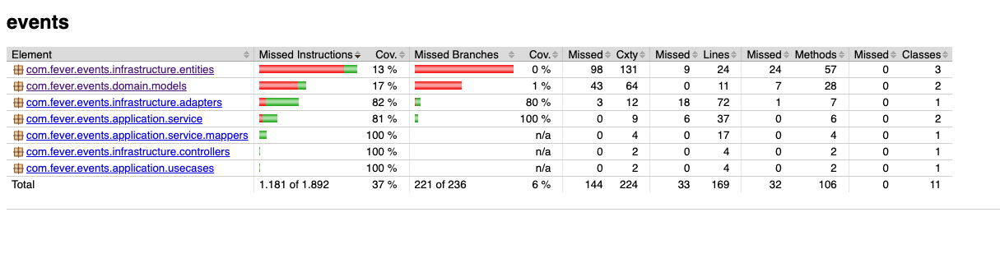
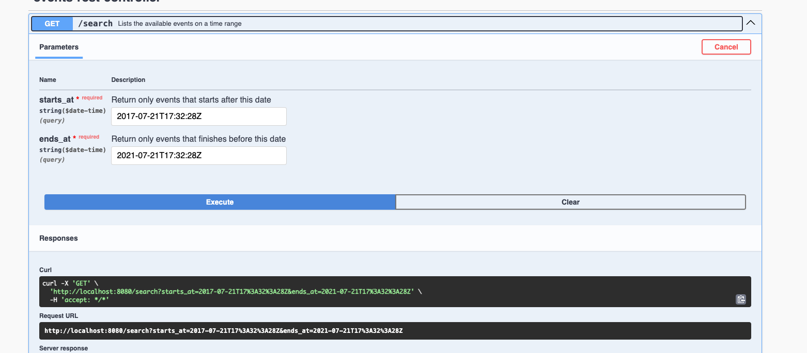
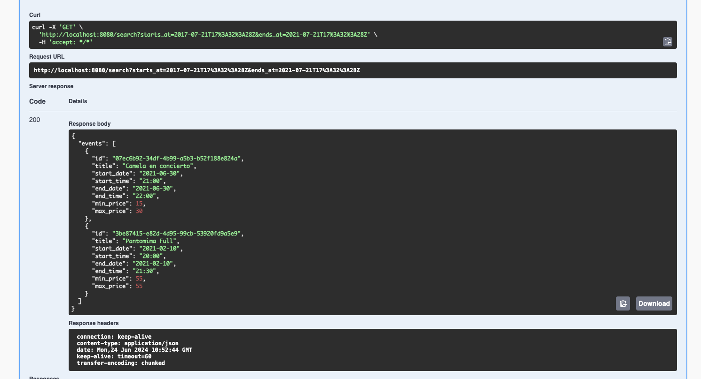

# Event Microservice Project

## Stack used:
- Java 17
- Springboot 3.3.1
- Swagger Open API : 3.0.0
- PostgreSQL13 database
- JUnit and Mockito

## Introduction
## Logical View of the Solution

After analyzing the requirements, the following solution has been developed, which can be visualized in the attached diagram:

A single microservice named `events` has been chosen, which manages two main processes:

1. **Extraction and Feeding of the PostgreSQL Database**:
   - The data will be stored in a PostgreSQL database to ensure its persistence, guaranteeing availability even if the external provider is down.
   - A dedicated service will make calls to the external provider daily at night, when application activity is minimal, to avoid affecting its performance.
   - For this task, WebClient from Spring WebFlux will be used, a non-blocking alternative ideal for handling a high volume of simultaneous requests.

2. **Exposure of the `/search` Endpoint**:
   - This endpoint will obtain the necessary data from the PostgreSQL database, filtering by the start and end date of the events.
   - Swagger API will be used to define the endpoint specifications in a `swagger.yaml` file, facilitating integration with third parties.

## Sequence Diagram

The following sequence diagrams illustrate both processes:

## Hexagonal Architecture

A hexagonal architecture has been adopted for the microservices, dividing the application into layers independent of each other. This structure separates business logic from the user interface and external infrastructure, facilitating maintenance and testing.

### Benefits of Hexagonal Architecture

- **Layer Independence**: Internal layers do not depend on external ones. The domain layer does not depend on any other layer, and the use case layer connects through ports to the domain layer.
- **SOLID Principles**: This architecture facilitates the adherence to SOLID principles, improving code quality, maintainability, and scalability.
- **Unit Testing**: The clear structure allows for effective unit testing using JUnit and Mockito.

## Architecture Components

- **Application**: Implements business logic and handles HTTP requests through the REST controller.
- **Domain**: Defines the internal logic of the application and the data models.
- **Infrastructure**: Manages the connection with the database (PostgreSQL) and external services (WebClient).
- **EventsApplication.java**: Main entry point of the application.

## Applied SOLID Principles

1. **Single Responsibility (SRP):** Each class should have a single responsibility. For example, the REST Controller only handles HTTP requests, the Business Service handles business logic, and the Repositories handle data access.
2. **Open/Closed (OCP)**: The system must be open for extension but closed for modification. This is achieved through interfaces and abstract classes. For example, the ProviderService interface can have implementations for the external provider and database.
3. **Liskov Substitution (LSP)**: Derived classes must be substitutable for their base classes. This is ensured through the use of interfaces and proper inheritance.
4. **Interface Segregation (ISP)**: Clients should not be forced to rely on interfaces that they do not use. Create specific interfaces for each use case, for example, BaseEventRepository.
5. **Dependency Inversion (DIP)**: Abstractions should not depend on details, but details should depend on abstractions. Use dependency injections for service and repository classes. In this project we use several dependency injections.

## Persistence in PostgreSQL Database
Data from the external provider is stored in PostgreSQL.

As for the database, we have chosen to store all the data from the external supplier, since they could be needed at any time and in this way we do not have to carry out a new development.
All tables are indexed by indexes to ensure optimal query performance.

## Testing and Coverage with Jacoco

Unit tests have been performed on all the classes implemented in this exercise, thus achieving a total coverage of almost 100%. This has been done to test individual units of code, ensuring that each class works correctly in isolation.
JUnit and mockito have been used for this purpose. 
In some specific cases use has been made of: Lenient Stubbing: which allows certain stubbings to be more flexible and not be marked as unnecessary if they are not used in all tests. 

These tests were performed using a coverage report was generated with Jacoco, available at `target/site/jacoco/index.html` after executing `mvn clean package`.

To run all the tests you can make use of the makefile file and execute the command:
 `make test`

## Observability: Traceability and Monitoring

Throughout the entire application code, a log and traceability strategy has been implemented to facilitate the correct understanding and maintenance of the application. 
This integration not only improves the traceability of the code, but also facilitates the identification and resolution of problems by providing detailed information about the workflow and any errors that may occur. 
For this purpose, we have used the slf4j. 
Extra explained in the section: NEXT STEPS

## Performance

Several things have been taken into account to highlight:
- Use of WebClient: WebClient is Spring WebFlux's non-blocking alternative for making HTTP calls, which is ideal for handling a high number of concurrent requests.
- Scheduling a task to run automatically every night to avoid system overload when data injection is higher and Fever has users on the platform.
* PostgreSQL: It is a robust relational database that supports a wide range of features and is suitable for handling large volumes of data. Use has been made of indexes to improve query performance.

## Building and Running the Application

The project includes a `make` file with the following options:

- `make build`: internally performs a mvn clean package to compile and package the project.
- `make run`: to raise the application. Internally it makes a "docker-compose up" which has a definition of a PostgreSQL database that creates a new database, makes the connection with this database and creates the necessary tables for the data extraction process from the external provider. This is achieved because in the /scripts folder we have a sql init.sql script.
- `make clean`: it shuts down the docker container and performs a `mvn clean`.

Extra explained in the section: NEXT STEPS: in the future, it would be interesting to perform a continuous integration process, in which a CI/CD pipeline of continuous integration is created. 

To test the application:

1. `make build`
2. `make run`

Access Swagger to test the exposed endpoint at: `http://localhost:8080/swagger-ui/index.html`

**Endpoint Tests**:

- **200**: Successful response.
- **400**: Bad request error.
- **500**: Server error.

---

**Swagger Validation**:

The `swagger.yaml` file has been validated using [Swagger Editor](https://editor-next.swagger.io/).

---

**Note**: When the application is started, a scheduled task is configured to run every 5 minutes for testing. In production, this task should run once a day at 3 am.

---

Reminder:
If you have any problems with the container, remember that you can use these commands to view the runs:
Docker Commands:

- View containers: `docker ps -a -q`
- Stop executions: `docker-compose down -v`
- Test friendly endpoint: `http://localhost:8080/swagger-ui/index.html`

---

## Mille extra
## Next Steps

- **Monitoring and Traceability**: To monitor the application, Spring Boot Actuator can be used in conjunction with monitoring tools such as Prometheus and Grafana. Actuator exposes metrics, system health and other useful information about the application. This allows us to monitor microservice performance and detect potential problems before they affect users.
In addition, alerts can be configured to notify about any anomalies in the performance or availability of the service.

- **Additional Testing**:
    * Integration Testing: test the interaction between different parts of the system, such as REST drivers, services and repositories. Spring Boot Test facilitates these tests.
    * Contract Testing: Use Pact to ensure that contracts between services (e.g., internal service and external provider) are respected.
    * Load Testing: JMeter or Gatling to simulate a large number of requests and ensure that the application can handle the high traffic.
- **Performance Optimization**: a caching system could be implemented to temporarily store the external provider's responses. Use solutions such as Redis to store events and minimize provider API calls.
- **Load balancers** could be implemented to distribute incoming requests among multiple instances of the service.
- **Continuous Integration**: Establish a CI/CD pipeline with tools like Travis or GitHub Actions. For later production deployment, new configuration files must be created for each of the environments we will use.
- Perhaps a **queuing mechanism** (e.g. Kafka or RabbitMQ) could be used to process and store events asynchronously. This will allow us to handle large volumes of data and keep the database synchronized without affecting performance.
-**Horizontal Scaling**: Implement a load balancer (e.g., Nginx or AWS ELB) to distribute requests across multiple instances of the microservice.
-**Use a container orchestrator such as Kubernetes** to manage automatic horizontal scaling based on traffic load.

### Additional Considerations

As the system grows, consider further decomposing the microservices to handle different aspects of events efficiently (e.g., one service specifically for data extraction and another for Endpoin).

